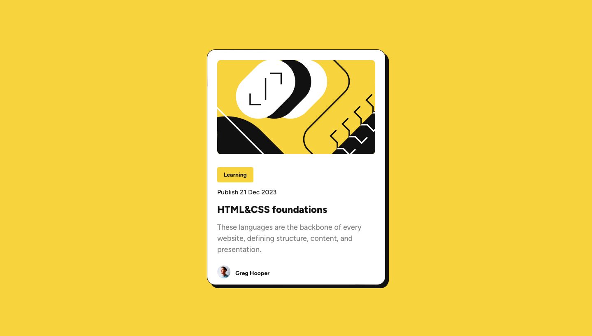

# Frontend Mentor - Blog preview card solution

This is a solution to the [Blog preview card challenge on Frontend Mentor](https://www.frontendmentor.io/challenges/blog-preview-card-ckPaj01IcS). Frontend Mentor challenges help you improve your coding skills by building realistic projects. 

## Table of contents

- [Overview](#overview)
  - [Screenshot](#screenshot)
  - [Links](#links)
- [My process](#my-process)
  - [Built with](#built-with)
- [Author](#author)
- [React + Vite](#create-react-app)
  - [Available Scripts](#available-scripts)
  - [Learn More](#learn-more)
- [Deployment](#deployment)
- [References](#references)


## Overview

### Screenshot




### Links

- Solution URL: [repository](https://github.com/ArcidesFerrao/blog-card-preview)
- Live Site URL: [github-pages](https://arcidesferrao.github.io/blog-card-preview/)

## My process

### Built with

- Semantic HTML5 markup
- CSS custom properties
- Flexbox
- [React](https://reactjs.org/) - JS library
- [Vite](https://vitejs.dev/guide/)


## Author

- Frontend Mentor - [@ArcidesFerrao](https://www.frontendmentor.io/profile/ArcidesFerrao)
- Twitter - [@Arcides_](https://www.twitter.com/Arcides_)

## React + Vite

This template provides a minimal setup to get React working in Vite with HMR and some ESLint rules.

### Create Vite 

With NPM:

```shell
$ npm create vite@latest vite-app -- --template react
```

`vite-app` used to specify the name of the folder that will be created.

Then, move to the project folder and `run`:

```shell
$ cd vite-app
```
```shell
$ npm install
```
```shell
$ npm run dev
```

### Available Scripts

In the project directory, you can run:

#### `npm run dev`

Runs the app in the development mode.\
Open [http://localhost:5173](http://localhost:5173) to view it in your browser.

The page will reload when you make changes.\
You may also see any lint errors in the console.


#### `npm run build`

Builds the app for production to the `build` folder.\
It correctly bundles React in production mode and optimizes the build for the best performance.

The build is minified and the filenames include the hashes.\
Your app is ready to be deployed!

See the section about [deployment](https://facebook.github.io/create-react-app/docs/deployment) for more information.


## Deployment

### Install `gh-pages` 

1. Install the [`gh-pages`](https://github.com/tschaub/gh-pages) npm package and designate it as a [development dependency](https://docs.npmjs.com/specifying-dependencies-and-devdependencies-in-a-package-json-file):
 
    ```shell
    $ npm install gh-pages --save-dev
    ```

The `gh-pages` npm package is installed on your computer and the React app's dependence upon it is documented in the React app's `package.json` file.

### Add a `homepage` property to the `package.json` file

1. Open the `package.json` file in a text editor.
   
    ```shell
    $ vi package.json
    ```

2. Add a `homepage` property in this format\*: `https://{username}.github.io/{repo-name}`

    > \* For a [project site](https://pages.github.com/#project-site), that's the format. For a [user site](https://pages.github.com/#user-site), the format is: `https://{username}.github.io`. You can read more about the `homepage` property in the ["GitHub Pages" section](https://create-react-app.dev/docs/deployment/#github-pages) of the `create-react-app` documentation.

    ```diff
    {
      "name": "my-app",
      "version": "0.1.0",
    + "homepage": "https://gitname.github.io/react-gh-pages",
      "private": true,
    ```
The React app's `package.json` file includes a property named `homepage`.

### Add deployment scripts to the `package.json` file

1. Open the `package.json` file in a text editor (if it isn't already open in one).
   
    ```shell
    $ vi package.json
    ```

2. Add a `predeploy` property and a `deploy` property to the `scripts` object:

    ```diff
    "scripts": {
    +   "predeploy": "npm run build",
    +   "deploy": "gh-pages -d build",
        "start": "react-scripts start",
        "build": "react-scripts build",
    ```

The  React app's `package.json` file includes deployment scripts.

### Add a "remote" that points to the GitHub repository

1. Add a "[remote](https://git-scm.com/docs/git-remote)" to the local Git repository.

    You can do that by issuing a command in this format: 
    
    ```shell
    $ git remote add origin https://github.com/{username}/{repo-name}.git
    ```
    
    To customize that command for your situation, replace `{username}` with your GitHub username and replace `{repo-name}` with the name of the GitHub repository you created in Step 1.

    > That command tells Git where I want it to push things whenever I—or the `gh-pages` npm package acting on my behalf—issue the `$ git push` command from within this local Git repository.

The local repository has a "remote" whose URL points to the GitHub repository you created in Step 1.

### Push the React app to the GitHub repository

1. Push the React app to the GitHub repository

    ```shell
    $ npm run deploy
    ```

    > That will cause the `predeploy` and `deploy` scripts defined in `package.json` to run.
    >
    > Under the hood, the `predeploy` script will build a distributable version of the React app and store it in a folder named `build`. Then, the `deploy` script will push the contents of that folder to a new commit on the `gh-pages` branch of the GitHub repository, creating that branch if it doesn't already exist.

    > By default, the new commit on the `gh-pages` branch will have a commit message of "Updates". You can [specify a custom commit message](https://github.com/gitname/react-gh-pages/issues/80#issuecomment-1042449820) via the `-m` option, like this:
    > ```shell
    > $ npm run deploy -- -m "Deploy React app to GitHub Pages"
    > ```

The GitHub repository contains a branch named `gh-pages`, which contains the files that make up the distributable version of the React app. However, we haven't configured GitHub Pages to _serve_ those files yet.

### Configure GitHub Pages

1. Navigate to the **GitHub Pages** settings page
   1. In your web browser, navigate to the GitHub repository
   1. Above the code browser, click on the tab labeled "Settings"
   1. In the sidebar, in the "Code and automation" section, click on "Pages"
1. Configure the "Build and deployment" settings like this: 
   1. **Source**: Deploy from a branch
   2. **Branch**: 
      - Branch: `gh-pages`
      - Folder: `/ (root)`
1. Click on the "Save" button

**That's it!** The React app has been deployed to GitHub Pages! :rocket:

### (Optional) Store the React app's _source code_ on GitHub

In a previous step, the `gh-pages` npm package pushed the distributable version of the React app to a branch named `gh-pages` in the GitHub repository. However, the _source code_ of the React app is not yet stored on GitHub.

In this step, I'll show you how you can store the source code of the React app on GitHub.

1. Commit the changes you made while you were following this tutorial, to the `master` branch of the local Git repository; then, push that branch up to the `master` branch of the GitHub repository.

    ```shell
    $ git add .
    $ git commit -m "Configure Qr Code Solution for deployment to gh-pages"
    $ git push origin master
    ```

    > I recommend exploring the GitHub repository at this point. It will have two branches: `master` and `gh-pages`. The `master` branch will contain the React app's source code, while the `gh-pages` branch will contain the distributable version of the React app.

# References

1. [@vitejs/plugin-react](https://github.com/vitejs/vite-plugin-react/blob/main/packages/plugin-react/README.md) uses [Babel](https://babeljs.io/) for Fast Refresh
2. [GitHub blog: Build and deploy GitHub Pages from any branch](https://github.blog/changelog/2020-09-03-build-and-deploy-github-pages-from-any-branch/)
3. [Preserving the `CNAME` file when using a custom domain](https://github.com/gitname/react-gh-pages/issues/89#issuecomment-1207271670)
4. [Deploying a React App* to GitHub Pages](https://github.com/gitname/react-gh-pages)